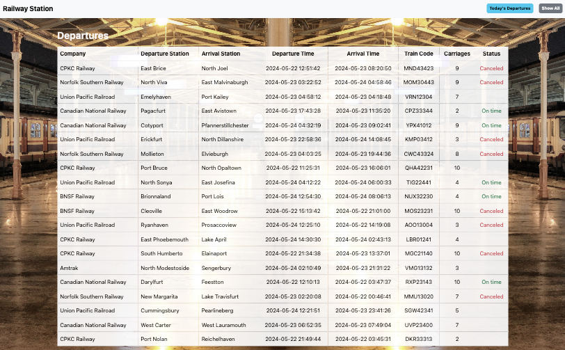

---

  

---

Steps:

- created a new project with <u>composer</u>
- created a new <u>Controller</u> and a <u>Model</u>
- created two <u>Routes</u>
- mapped a db in mysql with <u>Eloquent (Laravel's ORM)</u>
- created a new <u>Migration</u> and a <u>Seeder</u>
- used <u>Faker</u> to populate db

Preview:

